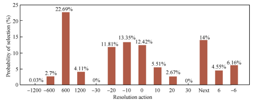

# Team name
### Enigma

## Summary

Our project is about solving conflicts between aircrafts. In our days there are a lot of aircrafts in the air and often they have some conflicts. Dispatchers try to solve them using different methods. Our project provide recommendation system that recomend actions to solve conflicts. According to this recomendations dispatchers can solve conflict fater and easierd.

## Background

With the rapid growth of flight flow, the workload of controllers is increasing daily, and
handling flight conflicts is the main workload.  To cope with the continuous increase
of flight flow and reasonably reduce the controller’s workload,
intelligent conflict resolution methods should be studied to
provide the controller with decision-making support in line
with actual operation. In our project, a Deep Reinforcement Learning algorithm is proposed to resolve aircraft flight conflict with high solving efficiency. Conflict
resolution algorithm based on DRL has great advantages in solution speed.

We are sure that thanks to our project the amount off flights well increase in the world . You can ask us that why we must use your project the main purpose of our project is to decrease the number of human action in the control because human can make mistakes any time but computer does not.


## How is it used?

The main goal of our project is to decrease the human actions and increase the amount of flights.Now there must be at lease 1 hours  between each flights in same direction but with the help of our project it will be decrease dramatically. In our code we used reinforcement learning which it learns things by itself, and also we used blockchain and lorawan Technology.

Why Blockchain?

Because the planes well send us datas with the help of this technology which is very secured  no one can hack it and no one can effect the datas.

Why lorawan?

The LoRaWAN protocol is a Low Power Wide Area Networking (LPWAN) communication protocol that functions on LoRa. The LoRaWAN specification is open so anyone can set up and operate a LoRa network.

LoRa is a wireless audio frequency technology that operates in a license-free radio frequency spectrum. LoRa is a physical layer protocol that uses spread spectrum modulation and supports long-range communication at the cost of a narrow bandwidth. It uses a narrow band waveform with a central frequency to send data, which makes it robust to interference.

## Data sources and AI methods. Simulation
We use open source air traffic simulator bluesky

Why BlueSky?

BlueSky is meant as a tool to perform research on Air Traffic Management and Air Traffic Flows. Its goal is to provide everybody who wants to visualize, analyze or simulate air traffic.

How we simulate a real-time flight? 

For scenario simulation we use Aviation API from AirLabs. The AirLabs Data API is designed to provide an easy way to get real-time global flight positioning data, flight schedules, and an impressive set of airlines, routes, airports, and other relevant aviation-related information.

Data Sources

| Source      | Description                                            |
|-------------|--------------------------------------------------------|
| BlueSky     | Create some custom conflicting scenarios               |
| AirLabs API | https://airlabs.co/api/v9/flights?api_key=YOUR-API-KEY |


## How to run

```
$ py main.py
```


## What next?

We well integrate blockchain and LoRaWAN in our system which will gives us security and fastest way to transfer datas from planes to our system . And also we would like to share our project with the bigest flight companies in the world . For provide the secury flights in the world.


## Acknowledgments




#### We would like to show you our fist stage and second stage progress:

* 100% conflict resoluted
* 70% from the first step
* 30% from the second step
